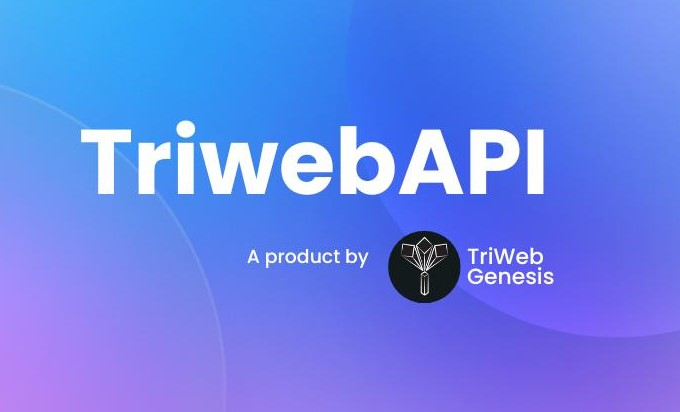

# Triweb Learning

A collection of awesome projects and various web development concepts.

This repo aims to learn and create. This is for familiarization with **MERN Stack** and various other tech-stacks.

## How to use this repository
Navigate through the folders and files within this repository to access the programming resources you're interested in.

## Tech Stack Used
         

**Client:** HTML5, CSS3, Javascript, React18, Bootstrap5, TypeScript5

**Server:** Node18, Express18

**DataBase:** MongoDB7, MySQL

## Prerequisites:

### Visual Studio Code:
VS Code is a "full-featured" and "convenient" development environment.
It is a source-code editor made by Microsoft. Features include support for debugging, syntax highlighting, intelligent code completion, snippets, code refactoring, and embedded Git.

### Xampp:
XAMPP is an abbreviation where X stands for Cross-Platform, A stands for Apache, M stands for MYSQL, and the Ps stand for PHP and Perl, respectively. It is an open-source package of web solutions that includes Apache distribution for many servers and command-line executables.

## Overview

* [HTML](./HTML/readme.md): 
    Learn the implementation of HTML forms and HTML Tables.

* [CSS](./CSS/readme.md): 
    Css for html form and table

* [Javascript](./Javascript/readme.md): 
    Core javascript concepts and their implementation. Diffrent features and building blocks of javascript.

* [MySQL](./MySQL/readme.md): 
    Performing basic crud operations of mysql, creating different tables, fetching data from tables & defining keys.
    
* [ES6](./ES6/readme.md): 
    Core concepts of ES6 which make brings new syntax and new awesome features like arrow functions, template strings, class destruction to make our code more modern and more readable.

* [NodeJS](./NodeJS/readme.md): 
    This is simple application with express.js and JSON. Perform basic calculations and created REST API's.
  
* [Python(Node-Python)](./Node-Python/readme.md): 
    It is a basic calculator. Work on iterations, conditions and loops.

* [MongoDB](./MongoDB/readme.md): 
    It is the document oriented database. Work on CRUD operations and many more features.

* [TypeScript](./TypeScript/readme.md): 
     Building typescript project from scratch and configuring typescript.

* [React](./React/readme.md): 
    An application using the open source library - **REACT**. Create api's and routers and connecting that to a backend database.

* [Projects](./Projects/readme.md): 
    A collection of awesome projects to refresh the concepts of web development (Frontend & backend). How to use the collection of technologies to create something interesting.
  
    * [Frontend Project](./Projects/Project-Forntend%20JS/readme.md): 
      This is basic javascript project to show the functionality of create user, delete user and move user to different blocks.

    * [Quiz manager application](./Projects/Quiz-Manager-App/readme.md): 
      This is a backend application to create and play quizes in which I created REST APIs using node with typescript and mongoDB.
    
    * [Tic-Tac-Toe](./Projects/tic-tac-toe/README.md): 
      In this project, I have implemented a basic tic-tac-toe game played by two players.
    
    * [Pet Adoption Project](./Projects/React-Project-Pet-Adoption/my-project/README.md): 
      It is a basic react project for understand react & bootstrap concepts.

    * [My Portfolio](./Projects/my-portfolio/README.md): 
      It is a react project in which my portfolio is implemented.

    * [NodeJS](./Projects/NodeJS/readme.md): 
      Basic backend project to connect with mysql database using sequelize.